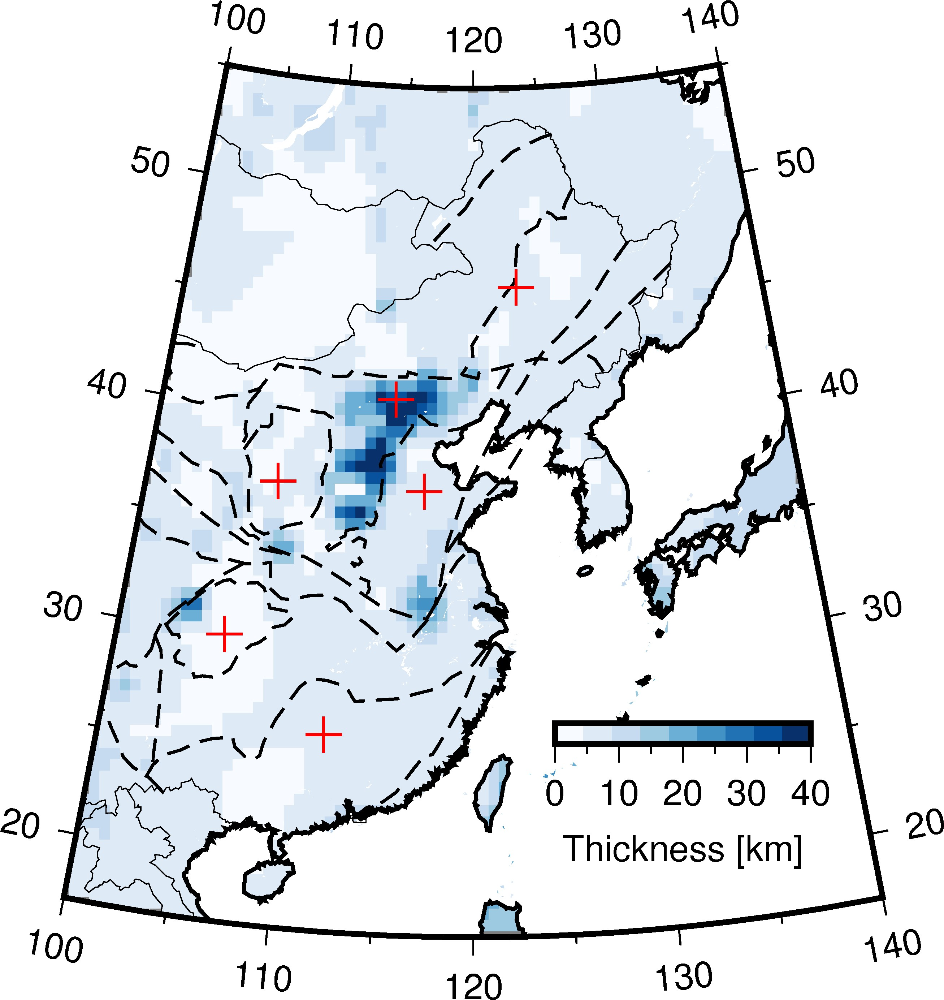

Moho depth clipped by coastline 
===============================

	
Keywords: clip, coastline, scale, image

.. code-block:: python
	:linenos:

	#!/usr/bin/env python

	import gmt as gmt5

	psfile = "moho_thick.ps"

	R = "100/140/17/55"
	# J = "B120/36/17/55/10c"
	J = "B120/36/17/55/8c"

	gmt = gmt5.Gmt()
	gmt.set("MAP_FRAME_TYPE", "plain")
	gmt.set("MAP_DEGREE_SYMBOL", "none")

	# gmt.shell("cat thickness_cmt.xyz | awk '{print $1,$2,$3}' > moho.xyz")
	gmt.shell("cat thickness_cmt.xyz | awk '{print $1,$2,$6}' > cmt.xyz")
	gmt.cmd("surface", "cmt.xyz -Gmoho.grd -I0.5/0.5 -R%s" % (R))
	gmt.cmd("makecpt", "-Ctest -T0/40 > color.cpt")

	# gmt.cmd("pscoast", "-J%s -R%s -Bx10f5 -By10f5 -W1/0.5p -N1 -A500 -K -Slightblue > %s" % (J, R, psfile))
	# gmt.cmd("surface", "data/tablea2.txt -Gmoho.grd -I0.5/0.5 -R-180/180/-90/90")
	# gmt.cmd("makecpt", "-Cmoho3.cpt -T20/70 > color.cpt")

	gmt.cmd("pscoast", "-J%s -R%s -K -Gc > %s" % (J, R, psfile))
	gmt.cmd("grdimage", "moho.grd -J%s -R%s -Ccolor.cpt -K -O >> %s" % (J, R, psfile))

	# gmt.cmd("pscontour", "cmt.xyz -R -J -K -O -C2 -W1p,blue >> %s" % (psfile))

	gmt.cmd("pscoast", "-J%s -R%s -K -O -Q >> %s" % (J, R, psfile))
	gmt.cmd("pscoast", "-J%s -R%s -K -O -Bx10f5 -By10f5 -W1/1p -N1 -A500 >> %s" % (J, R, psfile))
	# gmt.cmd("psscale", "-DjBR+w3c/0.3c+h -Ba10f5+l'Thickness [km]' -Ccolor.cpt -J -R -K -O -Xa-0.7c -Ya1.5c >> %s " % (psfile))
	gmt.cmd("psscale", "-DjBR+w2.5c/0.2c+h -Ba10f5+l'Thickness [km]' -Ccolor.cpt -J -R -K -O -Xa-0.7c -Ya1.5c >> %s " % (psfile))

	# cratonic boudary
	gmt.cmd("psxy", "-J -R -K -O -W0.8p,black,- data/China_tectonic.dat >> %s" % (psfile))

	gmt.cmd("psxy", "-J -R -O -T >> %s" % psfile)
	gmt.cmd("psconvert", "-A -P -Tj -E720 %s" % psfile)
	gmt.cmd("psconvert", "-A -P -Tf %s" % psfile)

	gmt.execute()

:download:`Download here <moho_thick.py>`